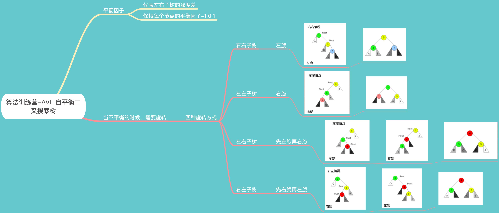

学习笔记

AVL旋转技巧：

位运算技巧：
* 将x最右边的n位清零： x & (~0 << n)
* 获取第n位是0或1 ：(x >> n) & 1
* 获取第n位的幂值：x & (1<<n)
* 仅将第n位置为1: x | (1 <<n)
* 仅将第n位置为0: x & (~(1<<n))
* 将x最高位至第n位（含）清零： x & ((1<<n)-1)

* 判断奇偶： x % 2 = (x & 1) == 1 ? 偶数 :  奇数
* x & ~x = 0 
* x & -x => 得到最低位的1